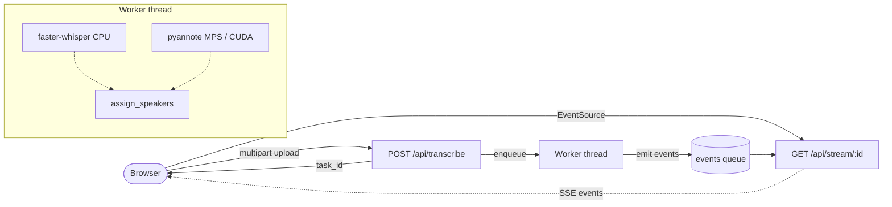

# Architecture

This document explains how Transcriptor is put together. It's aimed at
someone reviewing the project for the first time — engineers, recruiters,
or future me trying to remember why something was built the way it was.

If you want the *why* behind a specific decision (SSE vs WebSocket,
torch CPU-only, no build step, vanilla JS), read the ADRs in
[`docs/adr/`](./adr/). This document focuses on the *what* and *how*.

## High-level flow

A user drops an audio/video file onto the SPA. The browser opens an SSE
stream, receives segments live, and renders them as they arrive. When
diarisation is enabled, a second model runs in parallel on the GPU (MPS
on Apple Silicon, CUDA on NVIDIA, CPU otherwise) and produces speaker
turns that the worker merges into the transcript before completion.



The two ML models share no hardware, so we let them run concurrently and
take ``max(transcribe, diarise)`` wall-clock instead of the sum. See
[`services/transcription_worker.py`](../app/services/transcription_worker.py)
for the implementation and the ADR on parallel execution for the
rationale.

## Module map

```
app/
├── main.py                    # FastAPI factory. Mounts static + routers.
├── __init__.py                # __version__ — single source of truth.
│
├── routers/                   # HTTP layer (thin: parse → service → respond)
│   ├── health.py              # /api/health, /api/config
│   ├── hf.py                  # /api/hf/* (token, status, access)
│   ├── transcribe.py          # /api/transcribe, /api/stream, /api/download
│   └── models.py              # /api/models, .../download (SSE), DELETE
│
├── services/                  # FastAPI-agnostic orchestration
│   ├── task_manager.py        # In-memory registry with TTL eviction
│   ├── transcription_worker.py# Drives one transcription end-to-end
│   ├── hf_client.py           # HF whoami + access check (with timeouts)
│   ├── output_formatter.py    # Build .txt / .srt with speaker labels
│   └── sse.py                 # SSE wire format + recommended headers
│
├── domain/                    # Pure data structures, no I/O
│   └── task.py                # Task dataclass
│
├── transcriber.py             # faster-whisper wrapper (model cache, eviction)
├── diarizer.py                # pyannote.audio 4 wrapper + overlap assignment
├── models.py                  # Model catalog (size/speed/repo_id) + download/delete
├── token_store.py             # HF token persistence (UI > env > none)
│
└── static/                    # SPA (no build step)
    ├── index.html             # Shell + <template> elements
    ├── css/
    │   ├── base.css           # Variables, reset, scrollbar
    │   ├── layout.css         # Topnav, appshell, hero, section headers
    │   └── components.css     # Buttons, cards, model picker, HF card, etc.
    └── js/
        ├── main.js            # Bootstrap (hydrate icons, register routes)
        ├── router.js          # Hash-based SPA router with cleanup hooks
        ├── api.js             # fetch + SSE wrappers
        ├── ui.js              # Toast, modal, formatters
        ├── components/
        │   ├── icons.js       # SVG icons registry + hydrateIcons()
        │   └── bind.js        # ui('name') — chainable DOM helper
        └── views/
            ├── transcribe.js  # State machine + render layer
            └── settings.js    # HF wizard + model management
```

## Why these boundaries?

**Routers depend on services; services don't depend on routers.** This
isn't pedantic layering for its own sake — it means
`tests/test_models.py`, `tests/test_task_manager.py`, and
`tests/test_output_formatter.py` can exercise real logic without booting
FastAPI. Only `tests/test_api.py` uses `TestClient`, and even there the
ML calls are stubbed.

**`domain/` is pure data.** No FastAPI, no `requests`, no
`huggingface_hub`. The contract is: if a class here grows an import from
those libraries, it belongs in `services/` instead.

**Frontend views split state from render.** The transcribe view used to
be a 550-line closure where state, render, and effects were
interleaved. Now `class State extends EventTarget` is the single source
of truth, mutators dispatch a `change` event, and `render()` is
idempotent over the current state. This is the vanilla-JS equivalent of
Flux: unidirectional data flow, render as a function of state.

## SSE event protocol

The server emits JSON objects framed as SSE `data:` messages. The
client switches on `event.type`:

| `type`                | Producer                                  | Payload (keys)                                       |
|-----------------------|-------------------------------------------|------------------------------------------------------|
| `loading`             | `transcriber.transcribe_stream`           | `model`                                              |
| `info`                | `transcriber.transcribe_stream`           | `duration`, `language`, `language_probability`       |
| `segment`             | `transcriber.transcribe_stream`           | `segment: { index, start, end, start_ts, end_ts, text }` |
| `progress`            | `transcriber.transcribe_stream`           | `current`, `total`                                   |
| `done`                | `transcriber.transcribe_stream`           | `result: { full_text, srt, segments, ... }`          |
| `diarizing`           | `services.transcription_worker`           | _(none)_ — UI hint                                   |
| `diarization_done`    | `services.transcription_worker`           | `speakers`, `assignments`, `turns`                   |
| `diarization_error`   | `services.transcription_worker`           | `message`                                            |
| `error`               | `transcriber.transcribe_stream`           | `message`, `error_kind`                              |

The same protocol drives the model-download stream
(`/api/models/:key/download`) with `start`, `progress`, `done`, `error`.

## Task lifecycle

A `Task` is created on upload, registered in the `TaskManager`, and
written to by a worker thread. The HTTP stream endpoint pulls from
`task.events` (a thread-safe `queue.Queue`) until it sees the sentinel
`None`.

The `TaskManager` enforces two eviction policies:

1. **TTL**: a *finished* task is dropped after `DEFAULT_TTL_SECONDS = 3600`
   so the client can still hit `/api/download/:id/...` for a while after
   completion.
2. **Cap**: when the dict grows past `DEFAULT_MAX_TASKS = 64`, the
   oldest *finished* tasks are dropped. **Unfinished tasks are never
   evicted** — that would corrupt a live SSE stream.

The previous implementation used a bare `dict` with no eviction. Long
sessions accumulated audio paths and segment lists in RAM indefinitely.
The current design is exercised by `tests/test_task_manager.py`.

## Hugging Face token model

Two sources, one of them wins:

```
UI (~/.cache/transcriptor/config.json)  >  Environment (.env or shell)
```

- Setting a token via the UI overrides any `.env`-provided one.
- Deleting it via the UI falls back to the `.env` value if there is one.
- File permissions on the config are `0600` (POSIX only).

This is implemented in [`token_store.py`](../app/token_store.py) and
fully covered by `tests/test_token_store.py`. The `priority` test in
particular pins down the "delete falls back to env" behaviour, which has
caused real bugs in the past.

## What this project deliberately does *not* do

- **No auth.** This is a local-first single-user app. If you expose it
  on the LAN, put a reverse proxy with auth in front.
- **No build step.** Tailwind ships as a 400KB CDN runtime; ES modules
  load directly; no Webpack/Vite. See ADR 0003 for the trade-off.
- **No cancellation API for pyannote.** When transcription fails before
  diarisation completes, the background thread is daemonic and just
  exits when the process does. Adding cancellation would require
  pyannote to expose one.
